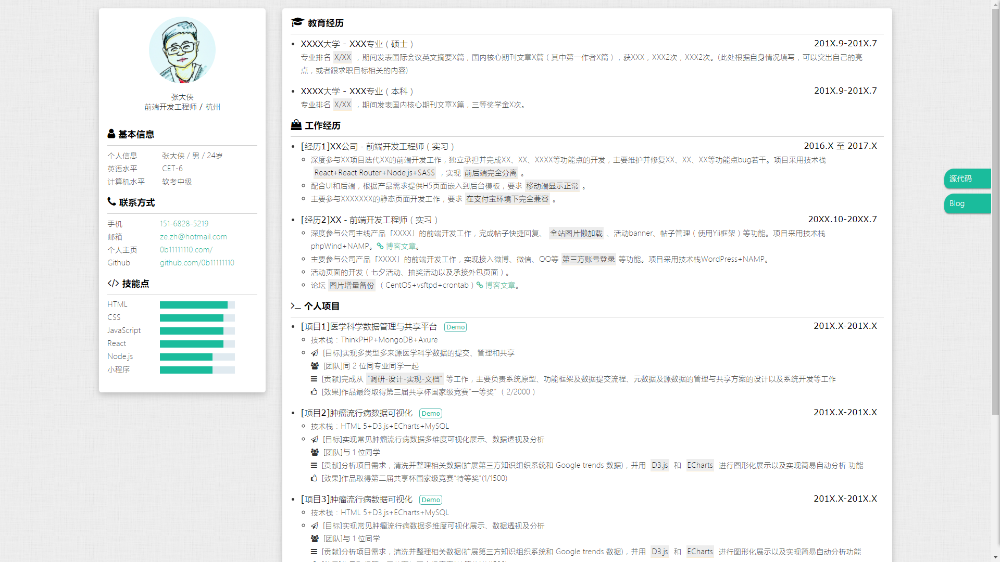

# 个人简历模板

https://keechaw163.github.io/

## Intro

此简历模板：

- 内容上，来源于我本人经历
- 风格上，参考众多简历风格，@DIYgod，@ekCit

欢迎提issue或者star，ღ( ´･ᴗ･` )比心

## Object

大数据求职/程序员求职

## Usage

1. 先Star/Fork本项目，然后Clone或者直接下载到本地
2. 修改index.html内相关信息
3. 微调样式（作为前端求职，这点应该不成问题）
4. 生成pdf(开发中)
5. 部署到线上
6. 生成访问二维码（开发中）
7. 祝您求职成功！

## Preview

### PC端

### 移动端

## TODO
- [x] 左栏固定（切换）
- [ ] 输出pdf功能
- [ ] 可编辑

## ChangeLog
- 2023.6.20 提交更新个人简历

## Acknowledgments
- font-awesome提供字体图标

